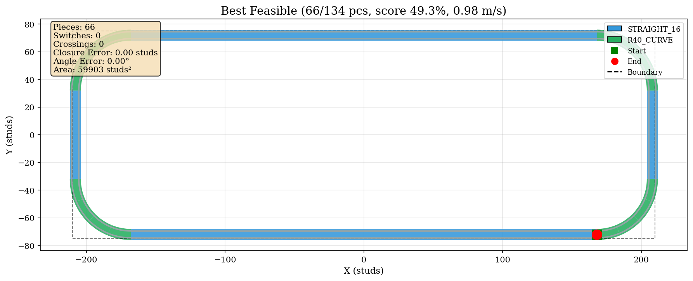
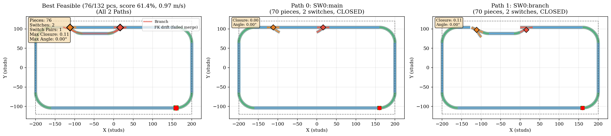
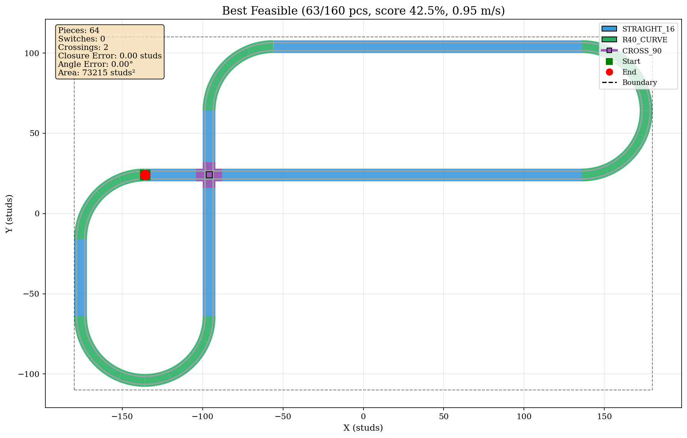
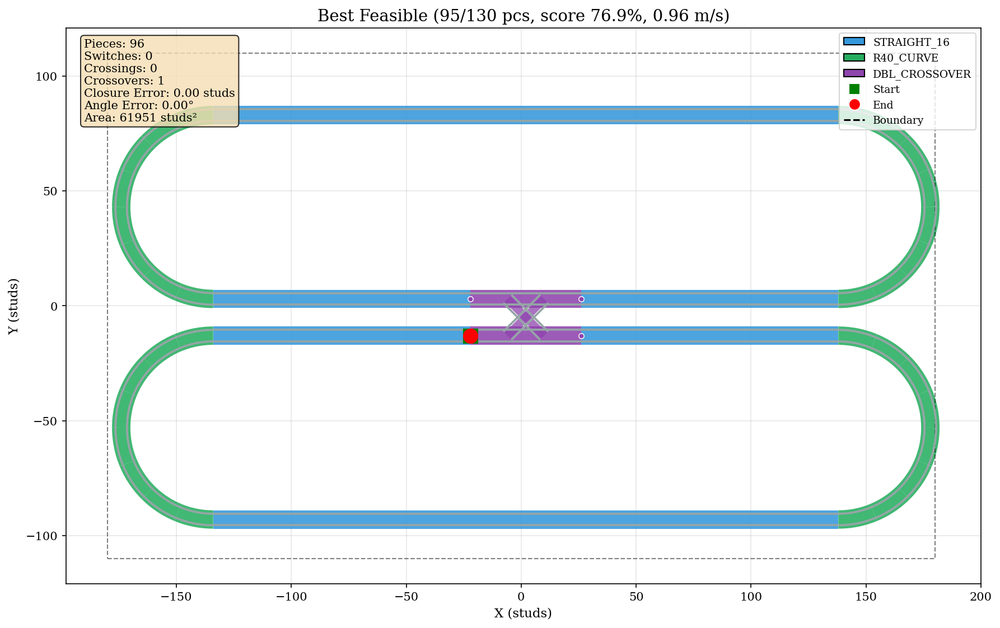
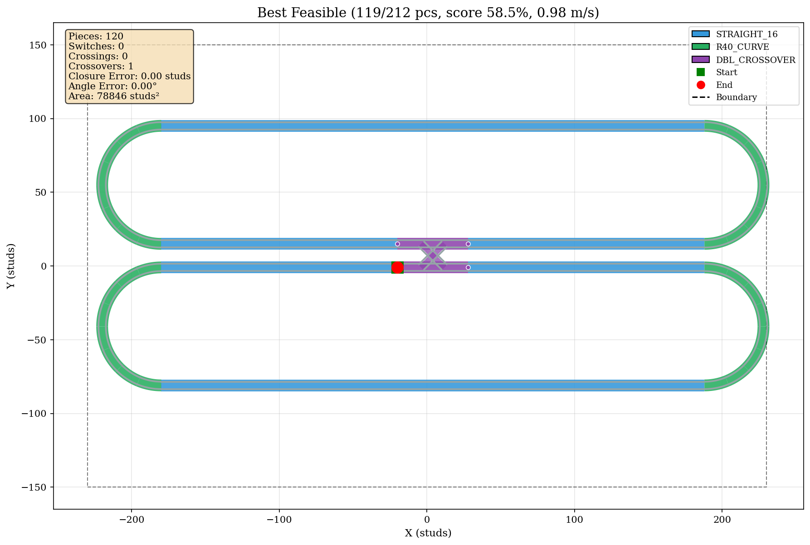
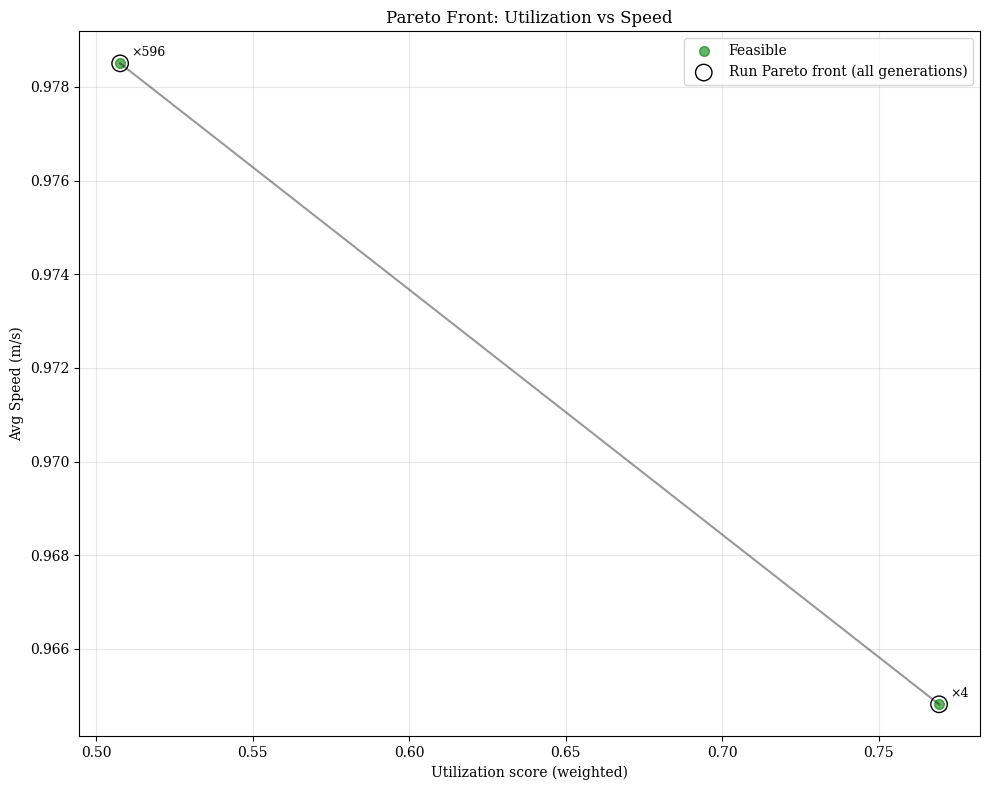

# LEGO Track Optimizer — Visual Overview

A picture-first companion to the [README](../README.md): what the system is, how a
layout travels from genes to a scored verdict, and **what the optimizer actually
produces** — every render below is a real `best_layout.png` from a recent run, with
its true metrics.

> Images live in `docs/images/` and are representative champions copied from
> `outputs/` (which is gitignored). Regenerate any of them with
> `python main.py --config configs/<name>.yaml --verbose`.

---

## What it is

A multi-objective genetic algorithm (**NSGA-II**, pymoo) that designs **closed
LEGO/4DBrix railway loops** from a **fixed box of parts** inside a **rectangular
boundary**. It maximizes piece utilization and train speed, while enforcing
buildability as hard constraints: the loop must close in position *and* heading, fit
the box, respect the inventory, and avoid illegal self-intersections.

---

## The journey: genes → geometry → verdict → evolution

```
   config (inventory + boundary)            catalog (FK, speed limits, routes)
            └───────────────┬─────────────────────────┘
                            ▼
   chromosome  int16, PARTITIONED, length = f(inventory)   ← never hardcoded
                            │   decode_chromosome()   [deterministic FK = cumsum]
                            ▼
   MultiPathLayout ─► inject sidings / CROSS_90 / DC ─► repair perpendicular overlaps
                            │   enumerate 2^J routes ─► auto-center in box
                            ▼
   F[0] weighted utilization      F[1] speed of the SLOWEST route
   G[0..2] closure x/y/θ   G[3] boundary   G[4] collisions   G[5..] inventory excess
                            │   NSGA-II (feasibility-first + adaptive ε) + 4-stage repair
                            ▼
   outputs/:  best_layout.png · pareto_front.png · *.csv · run_info.md · category_report.md
```

### The genome — one vector, six regions

```
┌─ main-loop types ─┬─ flips ─┬─ sidings ─┬─ cross ─┬─ DC ─┬─ start ─┐
│ piece per slot    │ L/R bit │  J × 4    │  K × 3  │ D×5  │  x, y   │
└───────────────────┴─────────┴───────────┴─────────┴──────┴─────────┘
   -1/S16/S24/R40    handedness  (act,pos,    …          …    offset
                                  hand,n)
```

Switches and crossings are **not** legal main-loop alleles — scattering them by random
mutation would be hopeless. They enter only through dedicated descriptor blocks,
stitched in and validated as a unit by the decoder. Every region's size is computed
from the inventory at startup.

---

## Track pieces — the R40-only kit

| # | Piece | Geometry | Speed limit |
|---|---|---|---|
| 0 / 1 | `STRAIGHT_16` / `STRAIGHT_24` | 16 / 24-stud straight | 1.57 m/s |
| 2 | `R40_CURVE` | 22.5° curve (16 per circle); direction = flip bit | **0.97 m/s** |
| 3 | `CROSS_90` | 90° crossing (FK identical to `STRAIGHT_16`) | 1.57 m/s |
| 4 / 5 | `R40_SWITCH_LEFT` / `_RIGHT` | switch, 32-stud body | through 1.57 / diverge 0.97 |
| 6 | `DOUBLE_CROSSOVER` | 48×16, 4 routes (2 through + 2 diagonal) | through 1.57 / cross 0.97 |

---

## Gallery of effects — what the GA produces

Each render is a feasible champion (closure 0.00 studs, angle 0.00°) from a recent
verification run.

### ① Plain loop — the baseline racetrack



**66/134 pieces · util 49.3% · 0.98 m/s · 0 specials.** Straights down the long sides,
R40 semicircles at the ends — the classic stadium oval. The box is a wide-short
420×150 rectangle with no room for a second lobe, so the boundary is the *binding*
constraint and the best layout is a single long racetrack. Run reached **600/600
feasible**.

### ② Passing siding — a branch the train can take or skip



**76/132 pieces · util 61.4% · 0.97 m/s · 1 switch pair.** The render is three panels:
the combined layout, then **Path 0 (SW0: main)** running straight through, then
**Path 1 (SW0: branch)** diverting onto the siding — both `2^J` routes enumerated and
both **CLOSED**. Orange diamonds mark the opposite-handed switch pair (1 LEFT +
1 RIGHT, the exit installed reversed).

### ③ Figure-8 with a CROSS_90 — a legalized self-crossing



**63/160 pieces · util 42.5% · 0.95 m/s · CROSS_90.** The loop genuinely crosses itself
at 90°, and a `CROSS_90` (purple square) sits exactly at the crossing — the decoder's
emergent self-intersection repair turning a loose straight-on-straight overlap into a
legal crossing piece.

### ④ Figure-8 with a DOUBLE_CROSSOVER — the utilization champion



**95/130 pieces · util 76.9% · 0.96 m/s · 1 double-crossover.** Two parallel ovals 16
studs apart, joined by a `DOUBLE_CROSSOVER` (purple X) in the middle. This is the
densest packing of any family — space-filling *within the same box* rather than by
enlarging it.

### ⑤ All pieces — multiple features in one run



**119/212 pieces · util 58.5% · 0.98 m/s.** The global champion of the `all_pieces_rect`
box is a double-crossover layout, but the run *also* keeps category elites alive: a
2-switch siding layout (40.6%) and a CROSS_90 layout (42.5%) survive side by side,
protected by the category-elite archive from being out-competed by simpler loops.

---

## The bi-objective trade-off — the Pareto front



The front (utilization vs. speed) for the double-crossover run is just **two points**,
and it is telling:

- A cheap, fast corner — util ≈ 0.51, speed ≈ 0.985 m/s — found by **596** individuals.
- The double-crossover figure-8 — util ≈ 0.77, speed ≈ 0.965 m/s — found by only **4**.

High utilization is **rare** and costs barely ~0.02 m/s; without the `CategoryEliteArchive`
those 4 individuals would be swept away by the 596 simpler ones.

---

## Current state — what works

- **All three special families close feasibly.** Passing sidings, `CROSS_90` figure-8s,
  and `DOUBLE_CROSSOVER` figure-8s all have real, closed elites (the first feasible
  cross/DC elites are a recent milestone).
- **High feasibility.** The plain racetrack run reached 600/600 feasible — the payoff of
  the translational closure-repair stage (which removed the old ~60% plateau where
  layouts were angularly closed but the tail overshot in position).
- **Speed is effectively saturated at the R40 curve cap (~0.97 m/s).** Every closed loop
  is curve-bound, so the *slowest* route always brushes the 0.97 limit. **Utilization is
  the real discriminator**, not speed.
- **Utilization ceilings match expectations.** A simple loop sits at ~49–61% (boundary-
  binding); the double-crossover figure-8 reaches ~77% by filling the *same* box with a
  space-filling crossing — never by growing the box.

---

*Generated from a full read of the README plus inspection of real run artifacts under
`outputs/`. Metrics are quoted verbatim from each run's `best_layout.png` title and
`category_report.md`.*